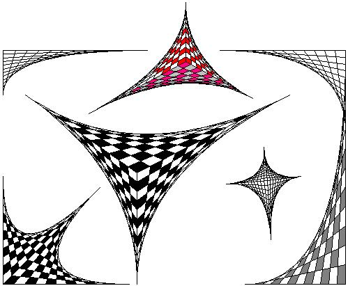

## Line Art v2\.0

### Description

Draw Line Art With Ease. Thank you to those who gave me positive suggestions on improving this program. You can now Load/Save/Copy/Undo/Size as well as change how the lines are generated. Please vote and give more suggestions - I really like where this program is going! P.S. The screen shot was colorized in MSPaint - cause I haven't figure out FloodFill in a PictureBox (yet)
 
### More Info
 

             |
---                |---
**Submitted On**   |2003-12-15 04:18:24
**By**             |[Jerome A\. Simon](https://github.com/Planet-Source-Code/PSCIndex/blob/master/ByAuthor/jerome-a-simon.md)
**Level**          |Beginner
**User Rating**    |4.7 (52 globes from 11 users)
**Compatibility**  |VB 6\.0
**Category**       |[Graphics](https://github.com/Planet-Source-Code/PSCIndex/blob/master/ByCategory/graphics__1-46.md)
**World**          |[Visual Basic](https://github.com/Planet-Source-Code/PSCIndex/blob/master/ByWorld/visual-basic.md)
**Archive File**   |[Line\_Art\_v16840312152003\.zip](https://github.com/Planet-Source-Code/jerome-a-simon-line-art-v2-0__1-50467/archive/master.zip)

